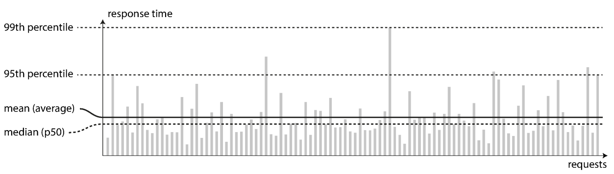

# software-architect-knowledge
 collection of software design, architect, and technical term knowledge

- Throughput (A1)
  - The number of record that can proccess per second
- Use Median for load test response time

### References
| ID  | Description                       |
| --- | --------------------------------- |
| A1  | Design Data Intensive Applications |
